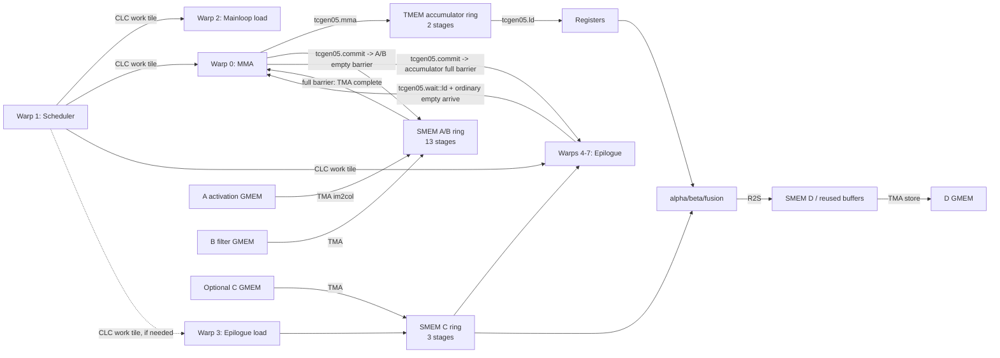

# SM100 Conv2d Fprop：Pipeline、UMMA 与 `tcgen05` 完整计算流程

## 0. 文档范围与结论

本文以以下测试实例为主线：

- 测试入口：[`sm100_conv2d_fprop_implicit_gemm_f16_f16_f16_tensorop_f16.cu:61`](test/unit/conv/device_3x/fprop/sm100_conv2d_fprop_implicit_gemm_f16_f16_f16_tensorop_f16.cu#L61)
- MMA tile：`Shape<_64, _64, Shape<_64>>`
- Cluster：`Shape<_1, _1, _1>`
- 数据类型：A/B/C/D/Accumulator 均为 `half`
- mainloop 和 epilogue 均使用 Auto schedule
- 当前工作区基准提交：`47f889bc`

文中的“本实例”专指上述 `64x64x64_1x1x1` case。2SM、multicast 以及其他数据类型只作为对照路径说明，不能当成本实例实际执行的路径。

第 12.4–12.9 节另外记录了 [`ncu/conv2d_NHWC_512_gpu0.ncu-rep`](ncu/conv2d_NHWC_512_gpu0.ncu-rep) 中按 NCU GUI 一基编号的**第 14 个 kernel**：`256x256x64`、2SM、FP32 accumulator、FP16 output + ReLU。第 12.10 节以后分析同一报告的**第 38 个 kernel**：`128x128x64`、1SM、FP32 accumulator、FP16 output + ReLU。两者构成 2SM/1SM 实测对照，但都不是本文主线的 `64x64x64`、1SM、FP16 accumulator 单元测试，不能直接把它们的 TMEM load shape 回填为主线实例。

最重要的结论是：

1. 本实例的 `KernelScheduleAuto` 选择 **1SM UMMA**，实际计算指令是 `tcgen05.mma.cta_group::1.kind::f16`。
2. A/B 经 TMA 进入 13 级 SMEM ring buffer；UMMA 从 SMEM descriptor 取 A/B，将 FP16 accumulator 写进 2 级 TMEM ring buffer。
3. `tcgen05.mma` 是异步的。CUTLASS 用 `tcgen05.commit...mbarrier::arrive` 把其完成事件挂到 pipeline 的 barrier 上：
   - mainloop 的 `consumer_release()` 提交到 A/B stage 的 **empty barrier**，防止 TMA 过早覆盖仍在被 UMMA 使用的 SMEM；
   - accumulator pipeline 的 `producer_commit()` 提交到 accumulator stage 的 **full barrier**，epilogue 等该 barrier 完成后才读取 TMEM。
4. Epilogue 用 `tcgen05.ld...pack::16b` 将 TMEM accumulator 搬到寄存器；在归还 TMEM stage 前执行 `tcgen05.wait::ld`，防止下一轮 UMMA 覆盖仍在异步读取的 TMEM。
5. accumulator pipeline 的 `consumer_release()` 在本实例中是普通 `mbarrier.arrive`，不是 `tcgen05.commit`。它与 mainloop pipeline 中同名函数的实现不同。
6. 本实例没有走 `tcgen05.cp`、`tcgen05.shift`、`tcgen05.st`、`tcgen05.wait::st` 或显式 `tcgen05.fence` 路径。

本文的编译期具体值使用当前源码和 NVCC 12.8 做过模板实例化确认，而不是仅依据类型名推测。

---

## 1. 本实例最终生成了什么

### 1.1 Auto schedule 为什么选择 1SM

测试在 [`测试文件:67-68`](test/unit/conv/device_3x/fprop/sm100_conv2d_fprop_implicit_gemm_f16_f16_f16_tensorop_f16.cu#L67-L68) 定义：

```cpp
using MmaTileShape = Shape<_64, _64, Shape<_64>>;
using ClusterShape = Shape<_1,_1,_1>;
```

`KernelScheduleAuto` 进入 [`sm100_make_tiled_mma()`](include/cutlass/conv/collective/builders/sm100_common.inl#L145)。只有同时满足：

```text
ClusterM % 2 == 0
TileM    % 128 == 0
```

才选择 2SM。当前 `ClusterM=1`、`TileM=64`，因此走 [`sm100_common.inl:170-173`](include/cutlass/conv/collective/builders/sm100_common.inl#L170-L173) 的 1SM 分支。

随后 F16 类型在 [`gemm/.../sm100_common.inl:320-324`](include/cutlass/gemm/collective/builders/sm100_common.inl#L320-L324) 选择：

```cpp
SM100_MMA_F16BF16_SS<half, half, half, 64, 64, Major::K, Major::K, ...>
```

### 1.2 实际编译期配置

| 项目 | 本实例的实际值 | 来源/意义 |
| --- | --- | --- |
| CTA MMA tile | `64 x 64 x 64` | 测试中的 `MmaTileShape` |
| Cluster | `1 x 1 x 1` | 单 CTA cluster，直接采用 1SM MMA |
| UMMA atom | `64 x 64 x 16` | F16 UMMA 的逻辑 K 固定为 `256 bit / 16 bit = 16`，见 [`mma_traits_sm100.hpp:235-238`](include/cute/atom/mma_traits_sm100.hpp#L235-L238) |
| 每个 K tile 的 UMMA 次数 | `64 / 16 = 4` | `mma()` 内部 `k_block` 展开；每个逻辑 K tile 发出 4 条 `tcgen05.mma` |
| Mainloop stages | `13` | 自动 SMEM carveout 后的实际模板结果 |
| Accumulator stages | `2` | builder 固定值，见 [`sm100_umma_builder.inl:177-182`](include/cutlass/conv/collective/builders/sm100_umma_builder.inl#L177-L182) |
| CLC scheduler stages | `1` | 同上 |
| Epilogue tile | `64 x 32` | 当前 epilogue Auto builder 的实际结果 |
| Epilogue C stages | `3` | 当前实际 dispatch policy |
| Epilogue D logical stages | `2` | 当前实际 dispatch policy |
| SMEM C/D 复用 | `true` | 因此实际 store pipeline 类型为 `PipelineTmaStore<3, 1>` |
| TMEM → register copy op | `SM100_TMEM_LOAD_16dp128b4x_16b` | 16-bit accumulator/output 的实际选择 |
| Mainloop tensor storage | `213248 B` | A/B 多级 SMEM storage 的实际模板结果 |
| Epilogue shared storage | `13312 B` | 当前 epilogue 的实际模板结果 |
| CTA threads | `256` | 8 warps，见下一节 |

这里的 `Shape<_64, _64, Shape<_64>>` 第三项虽然是嵌套 `Shape<_64>`，其 K 维总 size 仍为 64；`take<0,3>` 只裁剪外层，不会将嵌套 shape 展平。

### 1.3 编译期类型链

```text
测试 CollectiveBuilder<Sm100, ..., KernelScheduleAuto>
  -> SM100 Conv mainloop builder 偏特化
  -> sm100_make_tiled_mma(..., KernelScheduleAuto)
  -> 1SM 分支
  -> SM100_MMA_F16BF16_SS<..., M=64, N=64>
  -> MainloopSm100TmaUmmaWarpSpecializedImplicitGemm<
       Fprop, Stages=13, SpatialDims=2,
       SchedulerStages=1, AccumulatorStages=2, Cluster=1x1x1>
  -> CollectiveConv<...>
  -> ConvUniversal<ProblemShape, CollectiveMainloop, CollectiveEpilogue>
  -> sm100_implicit_gemm_tma_warpspecialized.hpp 中的 kernel 偏特化
```

关键模板落点：

- Mainloop builder 偏特化：[`sm100_umma_builder.inl:61`](include/cutlass/conv/collective/builders/sm100_umma_builder.inl#L61)
- Dispatch policy 构造：[`sm100_umma_builder.inl:233-250`](include/cutlass/conv/collective/builders/sm100_umma_builder.inl#L233-L250)
- Dispatch policy 定义：[`conv/dispatch_policy.hpp:102-131`](include/cutlass/conv/dispatch_policy.hpp#L102-L131)
- Mainloop collective 偏特化：[`sm100_implicit_gemm_umma_warpspecialized.hpp:77`](include/cutlass/conv/collective/sm100_implicit_gemm_umma_warpspecialized.hpp#L77)
- Device kernel 偏特化：[`sm100_implicit_gemm_tma_warpspecialized.hpp:63`](include/cutlass/conv/kernel/sm100_implicit_gemm_tma_warpspecialized.hpp#L63)

---

## 2. 从 Conv2d 到 implicit GEMM

对 NHWC Fprop，可把卷积理解为以下逻辑 GEMM：

```text
M_gemm = N_batch * P * Q
N_gemm = K_output_channels
K_gemm = R * S * C_input_channels

A_im2col[M_gemm, K_gemm] × B_filter[K_gemm, N_gemm]
    -> Acc[M_gemm, N_gemm]
```

这里并不会先在全局内存中物化一个完整的 im2col 矩阵。Mainloop builder 为 activation A 选择 TMA im2col copy，为 filter B 选择普通 tiled TMA copy，见 [`sm100_umma_builder.inl:130-162`](include/cutlass/conv/collective/builders/sm100_umma_builder.inl#L130-L162)。

所以数据路径是：

```text
Activation A (NHWC, GMEM) --TMA im2col--> SMEM A stage
Filter     B (NHWC/KRSC, GMEM) --TMA----> SMEM B stage
SMEM descriptors A/B --tcgen05.mma--> TMEM accumulator
TMEM --tcgen05.ld--> registers --epilogue--> SMEM D --TMA store--> GMEM D
                                  ^
                                  |
                      optional C: GMEM --TMA--> SMEM --register
```

---

## 3. Host 到 device 的调用链

```text
TEST(...)
  -> TestAllConv<Conv>()
  -> ConvTestbed<Conv>::run(...)
       -> 构造 problem/mainloop/epilogue/scheduler Arguments
       -> conv_op.can_implement(args)
       -> conv_op.initialize(args, workspace)
       -> conv_op()
  -> ConvUniversalAdapter<ConvKernel>::run(params)
  -> device_kernel<ConvKernel><<<grid, 256, smem_size>>>(params)
  -> Operator op;
     op(params, smem)
  -> ConvUniversal::operator()(Params const&, char* smem_buf)
```

对应代码：

- 测试实例构造类型并调用 `TestAllConv`：[`测试文件:61-100`](test/unit/conv/device_3x/fprop/sm100_conv2d_fprop_implicit_gemm_f16_f16_f16_tensorop_f16.cu#L61-L100)
- Testbed 构造参数、initialize 和运行：[`testbed_conv.hpp:352-468`](test/unit/conv/device_3x/testbed_conv.hpp#L352-L468)
- Host 参数降为 device 参数：[`kernel:233-263`](include/cutlass/conv/kernel/sm100_implicit_gemm_tma_warpspecialized.hpp#L233-L263)
- 1x1x1 cluster 直接 launch：[`conv_universal_adapter.hpp:337-345`](include/cutlass/conv/device/conv_universal_adapter.hpp#L337-L345)
- 通用 CUDA 入口最后调用 `op(params, smem)`：[`device_kernel.h:111-124`](include/cutlass/device_kernel.h#L111-L124)
- 真正的 kernel body：[`kernel:389`](include/cutlass/conv/kernel/sm100_implicit_gemm_tma_warpspecialized.hpp#L389)

---

## 4. 一个 CTA 内的 warp 分工

Kernel 用 `canonical_warp_idx_sync()` 将同一个 256-thread CTA 切成不同角色。定义见 [`kernel:211-217`](include/cutlass/conv/kernel/sm100_implicit_gemm_tma_warpspecialized.hpp#L211-L217)，映射见 [`kernel:398-435`](include/cutlass/conv/kernel/sm100_implicit_gemm_tma_warpspecialized.hpp#L398-L435)。

| Warp | 角色 | 主要工作 | 主要 pipeline |
| --- | --- | --- | --- |
| 0 | `MMA` | 分配 TMEM、等待 A/B、发出 UMMA、提交 accumulator、最终释放 TMEM | Mainloop consumer；Accumulator producer |
| 1 | `Sched` | CLC 查询与 work-tile 调度；1x1x1 中就是 CTA 的 scheduler | CLC producer + consumer |
| 2 | `MainloopLoad` | A/B TMA descriptor、13-stage TMA load | Mainloop producer；CLC consumer |
| 3 | `EpilogueLoad` | 按需将 C/aux 从 GMEM TMA 到 SMEM | Epilogue-load producer；CLC consumer |
| 4–7 | `Epilogue` | TMEM load、alpha/beta/fusion、R→S、TMA store D | Accumulator consumer；Epi-load consumer；Epi-store producer；CLC consumer |

线程数来自 [`kernel:122-132`](include/cutlass/conv/kernel/sm100_implicit_gemm_tma_warpspecialized.hpp#L122-L132)：

```text
1 scheduler warp
+ 1 MMA warp
+ 1 mainloop-load warp
+ 1 epilogue-load warp
+ 4 epilogue warps
= 8 warps = 256 threads
```

Epilogue-load warp 是运行时可选参与者。`is_producer_load_needed()` 为 false 时，warp 3 不进入 epilogue-load 分支。当前测试默认 `beta=0`，通常不需要读取 source C；但 pipeline 类型仍然在编译期存在。是否读取 C 最终由 fusion callback 的运行时参数决定，不能仅从 `ElementC` 非 void 推断。

---

## 5. Pipeline 总览与相互关系

### 5.1 总体关系图



虚线/反馈边代表控制权或 buffer 所有权归还，不是数据搬运。

### 5.2 每条 pipeline 的职责

| Pipeline/同步对象 | 深度 | Producer | Consumer | 负载放在哪里 | “数据已就绪”由谁完成 | “buffer 可复用”由谁完成 | 是否涉及 `tcgen05` |
| --- | ---: | --- | --- | --- | --- | --- | --- |
| Mainloop `PipelineTmaUmmaAsync` | 13 | Warp 2 | Warp 0 | SMEM A/B | TMA transaction 完成 full barrier | Warp 0 的 `tcgen05.commit` 到 empty barrier | 是，消费完成侧 |
| Accumulator `PipelineUmmaAsync` | 2 | Warp 0 | Warps 4–7 | TMEM accumulator | Warp 0 的 `tcgen05.commit` 到 full barrier | Epilogue 在 `tcgen05.wait::ld` 后普通 `mbarrier.arrive` empty barrier | 是，生产完成和 TMEM load 侧 |
| Epilogue load `PipelineTransactionAsync` | 3 | Warp 3 | Warps 4–7 | SMEM C/aux | TMA transaction 完成 full barrier | Epilogue 普通 empty-barrier release | 否 |
| Epilogue store `PipelineTmaStore<3,1>` | 3 个复用槽；逻辑 D 深度 2 | Warps 4–7 | TMA engine | SMEM D → GMEM D | `cp.async.bulk.commit_group` / scoreboard | `wait_group` 后复用 SMEM | 否 |
| CLC `PipelineCLCFetchAsync` | 1 | Warp 1 | 所有参与角色 | 16-byte CLC response in SMEM | CLC async op complete-tx | 各角色消费后 release | 否 |
| `OrderedSequenceBarrier<1,2>` | 1 | Warp 2 | Warp 3 | 无数据 | mainloop prologue 后 arrive | epilogue-load 首次 wait | 否 |
| TMEM allocation named barrier | 一次性 | Warp 0 | Warps 4–7 | SMEM 中的 TMEM base pointer | `tcgen05.alloc` 后 Warp 0 arrive | epilogue `arrive_and_wait` 后读取 pointer | alloc 本身是 `tcgen05` |
| TMEM deallocation cluster barrier | 仅 2SM 需要 | 两个 peer MMA warps | 两个 peer MMA warps | 无数据 | peer epilogue 均归还后互相同步 | 然后 collective dealloc | 本实例不走 |

### 5.3 所有 ring pipeline 共用的状态概念

`PipelineState<Stages>` 保存：

```text
index : 当前 ring slot
phase : 当前 slot 期待的 barrier parity
count : 已推进的逻辑迭代数
```

状态推进到 ring 末尾时 `index` 回到 0，并翻转 `phase`，见 [`sm90_pipeline.hpp:168-250`](include/cutlass/pipeline/sm90_pipeline.hpp#L168-L250)。Producer 从 `{index=0, phase=1, count=0}` 开始，因为初始 buffer 是 empty；consumer 默认从 phase 0 开始，见 [`sm90_pipeline.hpp:252-260`](include/cutlass/pipeline/sm90_pipeline.hpp#L252-L260)。

可以把一个普通 full/empty pipeline 记成：

```text
Producer waits EMPTY(stage, phase)
  -> writes/starts async production
  -> completes FULL(stage, phase)
Consumer waits FULL(stage, phase)
  -> reads/starts async consumption
  -> completes EMPTY(stage, phase)
```

SM100 这两条关键 pipeline 的特殊点只是“由谁完成 barrier”：

```text
Mainloop:    FULL <- TMA completion      EMPTY <- tcgen05 MMA completion
Accumulator: FULL <- tcgen05 MMA completion   EMPTY <- epilogue TMEM-load completion
```

这正是两条 pipeline 的连接关系：Mainloop 管 **SMEM A/B 的生命周期**，Accumulator 管 **TMEM accumulator 的生命周期**。

---

## 6. 单个 output tile 的完整时序

以下步骤在不同 warp 上并发执行，不应理解为全 CTA 严格串行。

### 6.1 初始化

1. Kernel 按 warp id 确定角色并构造 collective：[`kernel:398-418`](include/cutlass/conv/kernel/sm100_implicit_gemm_tma_warpspecialized.hpp#L398-L418)。
2. Warp 1/3 分别预取 mainloop/epilogue TMA descriptor：[`kernel:420-426`](include/cutlass/conv/kernel/sm100_implicit_gemm_tma_warpspecialized.hpp#L420-L426)。
3. 构造 mainloop、epilogue-load、epilogue-store、CLC、accumulator pipeline：[`kernel:438-517`](include/cutlass/conv/kernel/sm100_implicit_gemm_tma_warpspecialized.hpp#L438-L517)。
4. 初始化 barrier 后通过 `pipeline_init_arrive_relaxed()` / `pipeline_init_wait()` 保证 cluster 内可见：[`kernel:531-568`](include/cutlass/conv/kernel/sm100_implicit_gemm_tma_warpspecialized.hpp#L531-L568)。
5. Warp 0 执行 `tcgen05.alloc`，将 TMEM base pointer 写入 SMEM；Warp 0 与 epilogue warps 通过 named barrier 交接这个 pointer：[`kernel:663-674`](include/cutlass/conv/kernel/sm100_implicit_gemm_tma_warpspecialized.hpp#L663-L674)、[`kernel:795-802`](include/cutlass/conv/kernel/sm100_implicit_gemm_tma_warpspecialized.hpp#L795-L802)。

### 6.2 Scheduler/CLC 让各角色拿到同一个 work tile

Warp 1 调用 `advance_to_next_work()`：

```text
CLC producer_acquire
  -> clusterlaunchcontrol.try_cancel.async...
  -> CLC full barrier complete-tx
```

各角色分别调用 `fetch_next_work()`：

```text
CLC consumer_wait
  -> 从 SMEM response 解析 M/N/L tile id
  -> CLC consumer_release
```

源码入口：[`sm100_tile_scheduler.hpp:394-472`](include/cutlass/gemm/kernel/sm100_tile_scheduler.hpp#L394-L472)。CLC 只负责分派 work tile，不搬运 A/B/C/D，也不是 `tcgen05` 指令。

### 6.3 Warp 2：A/B TMA producer

Mainloop load 的入口在 [`collective mainloop:747-817`](include/cutlass/conv/collective/sm100_implicit_gemm_umma_warpspecialized.hpp#L747-L817)：

```cpp
pipeline.producer_try_acquire(state);       // 提前探测下一 empty stage
pipeline.producer_acquire(state, token);    // 等待该 SMEM stage 可写
tma_barrier = pipeline.producer_get_barrier(state);
copy(tmaA.with(*tma_barrier, ...), gA, sA); // TMA im2col
copy(tmaB.with(*tma_barrier, ...), gB, sB); // TMA tiled load
++state;
```

TMA 自己在搬运完成时更新 full transaction barrier，因此代码中的 `producer_commit()` 对 TMA mainloop 是 NOP。Warp 2 先填最多 13 个 prologue stages，再继续填剩余 K tiles，kernel 调用点见 [`kernel:578-607`](include/cutlass/conv/kernel/sm100_implicit_gemm_tma_warpspecialized.hpp#L578-L607)。

### 6.4 Warp 0：Mainloop consumer 与 UMMA producer

Warp 0 先等一个空闲 accumulator stage：

```cpp
accumulator_pipeline.producer_acquire(accumulator_state);
accumulators.data() = tmem_stage_ptrs[accumulator_state.index()];
```

见 [`kernel:690-707`](include/cutlass/conv/kernel/sm100_implicit_gemm_tma_warpspecialized.hpp#L690-L707)。然后进入 [`collective_mainloop.mma()`](include/cutlass/conv/collective/sm100_implicit_gemm_umma_warpspecialized.hpp#L900)：

```cpp
token = pipeline.consumer_try_wait(mainloop_state);
tiled_mma.accumulate_ = UMMA::ScaleOut::Zero;

for each K tile:
  pipeline.consumer_wait(mainloop_state, token); // 等 TMA 填好 A/B
  read_stage = mainloop_state.index();
  prefetch wait token for next stage;

  for k_block = 0..3:
    cute::gemm(...);                             // 发出 tcgen05.mma
    tiled_mma.accumulate_ = UMMA::ScaleOut::One;

  pipeline.consumer_release(current_state);     // tcgen05.commit -> A/B empty
```

第一次 UMMA 的 `enable-input-d=false`，执行 `D=A*B`，相当于清空/覆盖该 TMEM accumulator；之后改成 true，执行 `D=A*B+D`。对应设置在 [`collective mainloop:918-944`](include/cutlass/conv/collective/sm100_implicit_gemm_umma_warpspecialized.hpp#L918-L944)。

完成该 output tile 的所有 K tiles 后，kernel 立即调用：

```cpp
accumulator_pipeline.producer_commit(accumulator_state);
```

它再次发出 `tcgen05.commit`，但目标变成 accumulator pipeline 当前 stage 的 **full barrier**。见 [`kernel:700-709`](include/cutlass/conv/kernel/sm100_implicit_gemm_tma_warpspecialized.hpp#L700-L709)。

### 6.5 Warps 4–7：TMEM consumer 与 epilogue producer

Epilogue 入口是 [`kernel:795-867`](include/cutlass/conv/kernel/sm100_implicit_gemm_tma_warpspecialized.hpp#L795-L867)，核心 `store()` 流程如下：

1. `acc_pipeline.consumer_try_wait()` 提前探测 accumulator full barrier：[`epilogue:807-813`](include/cutlass/epilogue/collective/sm100_epilogue_tma_warpspecialized.hpp#L807-L813)。
2. 第一个 epilogue subtile 前，`consumer_wait()` 等 Warp 0 的 UMMA completion commit：[`epilogue:864-867`](include/cutlass/epilogue/collective/sm100_epilogue_tma_warpspecialized.hpp#L864-L867)。
3. `copy(tiled_t2r, ...)` 发出 `tcgen05.ld...pack::16b`：[`epilogue:869-883`](include/cutlass/epilogue/collective/sm100_epilogue_tma_warpspecialized.hpp#L869-L883)。
4. 最后一个 TMEM load 后调用 `fence_view_async_tmem_load()`，其真实 PTX 是 `tcgen05.wait::ld`；完成后才 `consumer_release()` 归还 accumulator stage：[`epilogue:885-890`](include/cutlass/epilogue/collective/sm100_epilogue_tma_warpspecialized.hpp#L885-L890)。
5. 对寄存器 accumulator 执行 alpha/beta/fusion：[`epilogue:892-896`](include/cutlass/epilogue/collective/sm100_epilogue_tma_warpspecialized.hpp#L892-L896)。
6. R→S 写入 SMEM D：[`epilogue:909-923`](include/cutlass/epilogue/collective/sm100_epilogue_tma_warpspecialized.hpp#L909-L923)。
7. 一个 warp 发出 TMA store，`producer_commit()` 对应 `cp.async.bulk.commit_group`，随后 acquire/wait 控制 SMEM buffer 复用：[`epilogue:765-800`](include/cutlass/epilogue/collective/sm100_epilogue_tma_warpspecialized.hpp#L765-L800)。

可选 source C 的路径是：Warp 3 通过 [`CollectiveEpilogue::load()`](include/cutlass/epilogue/collective/sm100_epilogue_tma_warpspecialized.hpp#L460) 做 TMA GMEM→SMEM；epilogue warps 在 [`epilogue:837-862`](include/cutlass/epilogue/collective/sm100_epilogue_tma_warpspecialized.hpp#L837-L862) 等待、读入寄存器并归还 SMEM stage。

### 6.6 Tail 与 TMEM 生命周期结束

Warp 0 完成所有 work tiles 后：

```text
tcgen05.relinquish_alloc_permit
  -> accumulator_pipeline.producer_tail() 等 epilogue 归还全部 stages
  -> 2SM 时再与 peer CTA 做 deallocation barrier（本实例跳过）
  -> tcgen05.dealloc
```

调用点为 [`kernel:713-734`](include/cutlass/conv/kernel/sm100_implicit_gemm_tma_warpspecialized.hpp#L713-L734)。`relinquish_alloc_permit` 只是放弃后续分配资格，不等于释放已分配 TMEM；真正释放由最后的 `dealloc` 完成。

---

## 7. 三组同名 pipeline API 为什么不能混看

### 7.1 Mainloop：`PipelineTmaUmmaAsync<13,...>`

类型别名在 [`collective mainloop:131-135`](include/cutlass/conv/collective/sm100_implicit_gemm_umma_warpspecialized.hpp#L131-L135)，包装类在 [`sm100_pipeline.hpp:537`](include/cutlass/pipeline/sm100_pipeline.hpp#L537)。

| API | 本实例真正做的事 | 等待/更新的对象 |
| --- | --- | --- |
| producer `try_acquire/acquire` | Warp 2 等 SMEM A/B stage 空闲 | empty barrier |
| producer `get_barrier` | 获得 TMA transaction barrier | full barrier |
| consumer `try_wait/wait` | Warp 0 等 TMA 完成 A/B load | full barrier |
| consumer `release` | `tcgen05.commit.cta_group::1...` | empty barrier；UMMA 完成后才 arrive |

`try_wait` 与 `wait` 最终委托给 `PipelineTmaAsync` 的 `mbarrier.try_wait`，源码见 [`sm100_pipeline.hpp:715-722`](include/cutlass/pipeline/sm100_pipeline.hpp#L715-L722) 和 [`sm90_pipeline.hpp:589-623`](include/cutlass/pipeline/sm90_pipeline.hpp#L589-L623)。`release` 则被 Blackwell wrapper 改写为 UMMA completion commit，见 [`sm100_pipeline.hpp:725-757`](include/cutlass/pipeline/sm100_pipeline.hpp#L725-L757)。

### 7.2 Accumulator：`PipelineUmmaAsync<2,...>`

包装类在 [`sm100_pipeline.hpp:118`](include/cutlass/pipeline/sm100_pipeline.hpp#L118)。

| API | 本实例真正做的事 | 等待/更新的对象 |
| --- | --- | --- |
| producer `acquire` | Warp 0 等 TMEM accumulator stage 空闲 | empty barrier |
| producer `commit` | `tcgen05.commit.cta_group::1...` | full barrier；UMMA 写 TMEM 完成后 arrive |
| consumer `try_wait/wait` | Epilogue 等 accumulator 已完整写入 TMEM | full barrier |
| consumer `release` | `PipelineAsync::consumer_release()` | 普通 empty-barrier arrive |

关键分派见 [`sm100_pipeline.hpp:212-269`](include/cutlass/pipeline/sm100_pipeline.hpp#L212-L269)。1SM 的 consumer release 走第 247 行的普通实现；只有 2SM 才进入专门的 remote empty-barrier arrive，但那个 helper 的 PTX 依然是 `mbarrier.arrive`，见 [`barrier.h:905-916`](include/cutlass/arch/barrier.h#L905-L916)。

### 7.3 Epilogue load：`PipelineTransactionAsync<3>`

这是 C/aux 的 TMA pipeline，与 TMEM completion 无关：

```text
producer_acquire -> TMA load/complete-tx -> consumer_wait
consumer reads SMEM -> consumer_release -> producer reuses SMEM
```

类型定义见 [`epilogue collective:195-205`](include/cutlass/epilogue/collective/sm100_epilogue_tma_warpspecialized.hpp#L195-L205)。

---

## 8. `tcgen05` 指令逐条索引（预留 SASS/NCU 列）

### 8.1 本实例实际会使用的指令

> 本表的 SASS 列仍保留为“待采集”，因为它描述的是 1SM + FP16 accumulator 主线实例。第 12.4–12.9 节是 2SM + FP32 accumulator，第 12.10 节以后虽是 1SM，但仍为 FP32 accumulator。PTX 与最终机器指令也不保证一对一，必须同时记录 kernel 配置、实际 cubin 和 toolchain。

| # | 生命周期阶段 | C++ 调用点 | PTX 封装/定义 | 本实例的 PTX | 作用与完成条件 | 典型动态频率 | SASS（待填） | NCU/PC/备注（待填） |
| ---: | --- | --- | --- | --- | --- | --- | --- | --- |
| 1 | TMEM 分配 | [`kernel:665`](include/cutlass/conv/kernel/sm100_implicit_gemm_tma_warpspecialized.hpp#L665) `tmem_allocator.allocate(...)` | [`tmem_allocator_sm100.hpp:75-85`](include/cute/arch/tmem_allocator_sm100.hpp#L75-L85) | `tcgen05.alloc.cta_group::1.sync.aligned.shared::cta.b32 [dst], nCols;` | 阻塞式分配 1SM TMEM；把 TMEM base address 写到 SMEM | 每 CTA 1 次 | 待采集 | 待填 |
| 2 | 矩阵乘加 | [`collective mainloop:941`](include/cutlass/conv/collective/sm100_implicit_gemm_umma_warpspecialized.hpp#L941) `cute::gemm(...)` | [`mma_traits_sm100.hpp:259-277`](include/cute/atom/mma_traits_sm100.hpp#L259-L277) → [`mma_sm100_umma.hpp:97-116`](include/cute/arch/mma_sm100_umma.hpp#L97-L116) | `tcgen05.mma.cta_group::1.kind::f16 [tmem_c], desc_a, desc_b, idesc, masks, p;` | 异步发起 `D=A*B` 或 `D=A*B+D`；A/B 来自 SMEM descriptor，D 在 TMEM | 每 K tile 4 次；每 output tile 为 `4 × k_tile_count` | 待采集 | 待填 |
| 3 | 归还 A/B stage | [`collective mainloop:944`](include/cutlass/conv/collective/sm100_implicit_gemm_umma_warpspecialized.hpp#L944) `mainloop_pipeline.consumer_release(...)` | [`sm100_pipeline.hpp:725-751`](include/cutlass/pipeline/sm100_pipeline.hpp#L725-L751) → [`barrier.h:796-805`](include/cutlass/arch/barrier.h#L796-L805) | `tcgen05.commit.cta_group::1.mbarrier::arrive::one.shared::cluster.b64 [empty_barrier];` | 让 empty barrier 跟踪此前 UMMA；只在 UMMA 不再读取该 A/B stage 后才 arrive | 每 K tile 1 次 | 待采集 | 待填 |
| 4 | 发布 accumulator | [`kernel:707`](include/cutlass/conv/kernel/sm100_implicit_gemm_tma_warpspecialized.hpp#L707) `accumulator_pipeline.producer_commit(...)` | [`sm100_pipeline.hpp:212-267`](include/cutlass/pipeline/sm100_pipeline.hpp#L212-L267) → [`barrier.h:796-805`](include/cutlass/arch/barrier.h#L796-L805) | `tcgen05.commit.cta_group::1.mbarrier::arrive::one.shared::cluster.b64 [full_barrier];` | 让 accumulator full barrier 跟踪此前所有 UMMA；完成后 epilogue 才能读 TMEM | 每 output/work tile 1 次 | 待采集 | 待填 |
| 5 | TMEM → register | [`epilogue:882`](include/cutlass/epilogue/collective/sm100_epilogue_tma_warpspecialized.hpp#L882) `copy(tiled_t2r,...)` | 选择：[`sm100_builder.inl:671-689`](include/cutlass/epilogue/collective/builders/sm100_builder.inl#L671-L689)；PTX：[`copy_sm100.hpp:1371-1392`](include/cute/arch/copy_sm100.hpp#L1371-L1392) | `tcgen05.ld.sync.aligned.16x128b.x4.pack::16b.b32 {r...}, [taddr];` | warp collective 异步读取 TMEM；`.pack::16b` 将两个 16-bit chunk 打包到 32-bit register | 每 epilogue subtile/warp copy 若干次；准确数量待 SASS 统计 | 待采集 | 待填 |
| 6 | 等 TMEM load 完成 | [`epilogue:887`](include/cutlass/epilogue/collective/sm100_epilogue_tma_warpspecialized.hpp#L887) `fence_view_async_tmem_load()` | [`barrier.h:923-934`](include/cutlass/arch/barrier.h#L923-L934) | `tcgen05.wait::ld.sync.aligned;` | 阻塞到当前线程此前的异步 `tcgen05.ld` 全部完成；之后才归还 TMEM stage | 每次 accumulator stage 最终归还前 1 次/参与 warp | 待采集 | 待填 |
| 7 | 放弃后续分配许可 | [`kernel:719`](include/cutlass/conv/kernel/sm100_implicit_gemm_tma_warpspecialized.hpp#L719) `release_allocation_lock()` | [`tmem_allocator_sm100.hpp:103-109`](include/cute/arch/tmem_allocator_sm100.hpp#L103-L109) | `tcgen05.relinquish_alloc_permit.cta_group::1.sync.aligned;` | 声明本 CTA 不再执行后续 `tcgen05.alloc`；让其他 CTA 更早获得 allocation permit | 每 CTA 1 次 | 待采集 | 待填 |
| 8 | TMEM 释放 | [`kernel:734`](include/cutlass/conv/kernel/sm100_implicit_gemm_tma_warpspecialized.hpp#L734) `tmem_allocator.free(...)` | [`tmem_allocator_sm100.hpp:88-100`](include/cute/arch/tmem_allocator_sm100.hpp#L88-L100) | `tcgen05.dealloc.cta_group::1.sync.aligned.b32 taddr, nCols;` | 释放之前分配的 TMEM；调用前 accumulator tail 已确认消费者归还 stages | 每 CTA 1 次 | 待采集 | 待填 |

### 8.2 同一条 `tcgen05.commit`，为什么有两个用途

两处调用发出相同 PTX family，但 barrier 地址不同：

| 调用 | barrier | 资源所有权含义 | 下一位等待者 |
| --- | --- | --- | --- |
| Mainloop `consumer_release` | `mainloop.empty_barrier[read_stage]` | A/B 的 SMEM stage 已不再被 UMMA 使用 | Warp 2 的 `producer_acquire` |
| Accumulator `producer_commit` | `accumulator.full_barrier[acc_stage]` | TMEM accumulator 已被 UMMA 完整写好 | Warps 4–7 的 `consumer_wait` |

`tcgen05.commit` 不是 SM90 的 WGMMA batch commit。它的语义是：让指定 mbarrier 跟踪当前线程此前发出的异步 `tcgen05.mma/cp/shift`，等这些操作真正完成后，由硬件对 mbarrier 做一次 arrive。

### 8.3 `consumer_release` 与 `umma_arrive` 是否相同

必须带上 pipeline 类型回答：

```text
PipelineTmaUmmaAsync::consumer_release
  -> umma_arrive
  -> tcgen05.commit ... mbarrier::arrive

PipelineUmmaAsync::consumer_release（本实例 1SM）
  -> PipelineAsync::consumer_release
  -> ordinary mbarrier.arrive
```

所以“`consumer_release` 是否与 `umma_arrive` 一样”没有统一答案。Mainloop 的是；Accumulator consumer 的不是。

### 8.4 本实例没有调用的 `tcgen05` 指令

| 指令 family | 本实例状态 | 一般用途 | SASS（待填） | NCU/备注（待填） |
| --- | --- | --- | --- | --- |
| `tcgen05.cp` | 未调用 | SMEM → TMEM 的异步数据搬运；常见于低精度解包、特殊 mainloop 或 emulated 路径 | 不适用 | 待填 |
| `tcgen05.shift` | 未调用 | 在 TMEM 中对数据位置做 shift，并可与后续 MMA/cp 形成 pipeline | 不适用 | 待填 |
| `tcgen05.st` | 未调用 | register → TMEM 异步写入 | 不适用 | 待填 |
| `tcgen05.wait::st` | 未调用 | 等待此前 `tcgen05.st` 完成 | 不适用 | 待填 |
| `tcgen05.fence::{before,after}_thread_sync` | 源码未显式调用 | 在跨线程同步两侧建立 `tcgen05` 专用执行次序 | 待确认 | 见第 10 节 |

---

## 9. `tcgen05` 完成机制：哪些操作等谁

### 9.1 `mma/cp/shift` 使用 mbarrier completion

```text
tcgen05.mma/cp/shift
  -> tcgen05.commit [...mbarrier...]
  -> hardware waits for prior tracked tcgen05 operations
  -> hardware performs mbarrier arrive
  -> consumer's mbarrier wait succeeds
```

### 9.2 `ld/st` 使用显式 wait completion

```text
tcgen05.ld
  -> tcgen05.wait::ld

tcgen05.st
  -> tcgen05.wait::st
```

本实例只使用第一行。函数名 `fence_view_async_tmem_load()` 容易产生误解：它不是 `tcgen05.fence`，真实指令是 `tcgen05.wait::ld`。

### 9.3 完成依赖矩阵

| 被保护的资源 | 异步生产/消费操作 | 完成观测 | 观测后允许的动作 |
| --- | --- | --- | --- |
| SMEM A/B stage | TMA 写入 | mainloop full transaction barrier | Warp 0 发出 UMMA |
| SMEM A/B stage | UMMA 异步读取 | `tcgen05.commit` 到 mainloop empty barrier | Warp 2 用 TMA 覆盖该 stage |
| TMEM accumulator stage | UMMA 异步写入 | `tcgen05.commit` 到 accumulator full barrier | Epilogue 发出 `tcgen05.ld` |
| TMEM accumulator stage | `tcgen05.ld` 异步读取 | `tcgen05.wait::ld` | Epilogue arrive empty barrier；Warp 0 可重用 stage |
| SMEM C stage | TMA 写入 | epilogue-load full transaction barrier | Epilogue 读取 C |
| SMEM D stage | TMA 读取并写 GMEM | TMA store scoreboard / wait group | Epilogue 重用 SMEM D stage |

---

## 10. 为什么看不到 SM90 的 WGMMA 三件套

SM90 典型路径使用 register accumulator 和 WGMMA async group：

```cpp
warpgroup_commit_batch();
warpgroup_wait<0>();
warpgroup_fence_operand(...);
```

SM100 本实例换成了不同协议：

```text
WGMMA async group       -> tcgen05 async operations
register accumulator   -> TMEM accumulator
wgmma commit/wait      -> tcgen05.commit + mbarrier full/empty pipeline
operand/register fence -> TMEM ownership hand-off + tcgen05.wait::ld
```

具体说：

- UMMA 结果是否已经写完 TMEM，不由 `tcgen05.wait::ld` 判断，而由 [`accumulator_pipeline.producer_commit()`](include/cutlass/conv/kernel/sm100_implicit_gemm_tma_warpspecialized.hpp#L707) 提交的 `tcgen05.commit` 和 epilogue 的 [`consumer_wait()`](include/cutlass/epilogue/collective/sm100_epilogue_tma_warpspecialized.hpp#L866) 判断。
- `tcgen05.wait::ld` 发生在相反方向：epilogue 已发出 TMEM→register load 后，等待这些 load 完成，才允许 MMA 重用 TMEM stage。
- 因而不能把 SM90 的三个 API 逐字映射为 SM100 的三个 API；两代架构的 accumulator 存储位置和异步完成模型不同。

### 10.1 跨 warp TCGEN ordering：源码疑问与第 14 个 kernel 的 SASS 观测

当前 CUTLASS C++/inline-PTX 路径中没有显式 `tcgen05.fence::after_thread_sync`。而当前 NVIDIA PTX ISA 的跨线程 canonical pattern 对：

```text
producer: tcgen05.mma -> tcgen05.commit(mbarrier)
consumer: mbarrier wait -> tcgen05.ld
```

展示了 `mbarrier wait` 后的 `tcgen05.fence::after_thread_sync`。因此后续分析实际 cubin 时，应专门核对：

1. 当前 NVCC/PTXAS 是否在 SASS 中生成了等价的 TCGEN ordering/fence；
2. CUTLASS 所用未带 `.relaxed` 的 `mbarrier.try_wait.parity.shared::cta` 在目标 toolchain 中承担了什么排序语义；
3. `tcgen05.ld` 对 accumulator full barrier 是否有架构/编译器认可的隐式依赖。

这不影响“UMMA 何时完成”的判断：完成事件明确由 `tcgen05.commit` 挂到 accumulator full barrier 上。但“跨 warp 的后续 TCGEN 指令如何被排序”是另一个层次的问题，不应把二者混为一谈。

第 12.4 节分析的第 14 个 2SM kernel 和第 12.10 节分析的第 38 个 1SM kernel 中，NCU 文本 SASS 都没有显示一个可唯一认定为 `tcgen05.fence::after_thread_sync` 的独立 opcode；`LDTM.x32` 后也没有一个可唯一认定为 `tcgen05.wait::ld` 的独立 mnemonic。报告里虽有 `FENCE.VIEW.ASYNC.S`，但第 38 个 kernel 的四个主要 epilogue site 都紧跟 `MEMBAR.ALL.CTA`，并位于 TMA store 前，与 [`fence.proxy.async.shared::cta`](include/cute/arch/copy_sm90_tma.hpp#L1217) 的位置和次数吻合，不能把它们等同为 TCGEN 专用 fence。因此当前能确认的是：

1. accumulator full barrier 的等待被 lower 为 `SYNCS.PHASECHK.TRANS64.TRYWAIT`；
2. TMEM load 被 lower 为 `LDTM.x32`；
3. NCU 的 `sass_by_pc()` 文本不展示完整 control-code/scoreboard 依赖，且该报告没有 PTX/source correlation，因而不足以证明 `tcgen05.wait::ld` 被删除，也不足以将其绑定到某一条单独 SASS。

若要最终闭环，需要从同一 cubin 用 `nvdisasm` 导出包含 control fields 的反汇编，再与 NCU PC offset 对齐；第 12.9 节保留了这个结论边界。

---

## 11. 2SM 与 multicast 对照路径

本实例不走下表，但后续分析其他 case 时可直接对照。

| 场景 | MMA PTX | commit PTX | allocator | 额外同步 |
| --- | --- | --- | --- | --- |
| 本实例 1SM、cluster 1x1x1 | `tcgen05.mma.cta_group::1...` | `tcgen05.commit.cta_group::1...` | `Allocator1Sm` | 无 peer CTA |
| 1SM MMA + TMA multicast cluster | `cta_group::1` | `cta_group::1...multicast::cluster` | `Allocator1Sm` | mainloop empty barrier multicast |
| 2SM MMA | `tcgen05.mma.cta_group::2...` | `tcgen05.commit.cta_group::2...multicast::cluster` | `Allocator2Sm` | peer CTA accumulator/TMEM deallocation 协调 |

相关定义：

- 2SM F16 UMMA：[`mma_sm100_umma.hpp:552-584`](include/cute/arch/mma_sm100_umma.hpp#L552-L584)
- 1SM/2SM commit 和 multicast 变体：[`barrier.h:796-863`](include/cutlass/arch/barrier.h#L796-L863)
- 1SM/2SM allocator：[`tmem_allocator_sm100.hpp:59-180`](include/cute/arch/tmem_allocator_sm100.hpp#L59-L180)
- Pipeline 分支选择：[`sm100_pipeline.hpp:740-757`](include/cutlass/pipeline/sm100_pipeline.hpp#L740-L757)

注意：PTX ISA 要求同一 kernel 内 `tcgen05` 指令的 `.cta_group` 取值保持一致。因此 1SM 与 2SM 是编译期分开的 kernel 配置，不是在同一 kernel 的运行时混用。

---

## 12. 后续 NCU/SASS 回填模板

### 12.1 建议保存的构建信息

| 字段 | 值 |
| --- | --- |
| CUTLASS commit | `47f889bc` |
| 本地改动哈希/说明 | 待填 |
| CUDA Toolkit / NVCC | 待填 |
| Driver | 待填 |
| GPU 型号 / SM | 待填 |
| 编译目标 | 预期 `sm_100a`；以实际命令为准 |
| 编译 flags | 待填 |
| 测试 filter | `SM100_device_conv2d_fprop_implicitgemm_f16nhwc_f16nhwc_f16nhwc_tensor_op_f16.64x64x64_1x1x1` |
| 最终 kernel mangled name | 待填 |
| cubin/可执行文件 | 待填 |

### 12.2 PTX ↔ SASS ↔ pipeline 对照表

| Pipeline 阶段 | 源码行 | PTX | SASS opcode | PC offset | Warp 角色 | 动态次数 | stall/依赖信息 | 备注 |
| --- | --- | --- | --- | --- | --- | ---: | --- | --- |
| TMEM alloc | `kernel:665` | `tcgen05.alloc...` | 待填 | 待填 | MMA | 待填 | 待填 | |
| Mainloop UMMA | `collective:941` | `tcgen05.mma...` | 待填 | 待填 | MMA | 待填 | 待填 | 每 K tile 预期 4 条 PTX |
| A/B empty commit | `collective:944` | `tcgen05.commit...` | 待填 | 待填 | MMA | 待填 | 待填 | 目标为 mainloop empty barrier |
| Acc full commit | `kernel:707` | `tcgen05.commit...` | 待填 | 待填 | MMA | 待填 | 待填 | 目标为 accumulator full barrier |
| TMEM load | `epilogue:882` | `tcgen05.ld...` | 待填 | 待填 | Epilogue | 待填 | 待填 | 需区分四个 epilogue warps |
| TMEM load wait | `epilogue:887` | `tcgen05.wait::ld...` | 待填 | 待填 | Epilogue | 待填 | 待填 | 归还 accumulator stage 前 |
| alloc permit release | `kernel:719` | `tcgen05.relinquish...` | 待填 | 待填 | MMA | 待填 | 待填 | |
| TMEM dealloc | `kernel:734` | `tcgen05.dealloc...` | 待填 | 待填 | MMA | 待填 | 待填 | |

### 12.3 NCU 分析时建议核对的问题

1. `tcgen05.mma` 的实际 SASS opcode、每 K tile 动态条数是否与 4 个 K atoms 对应。
2. 两处 `tcgen05.commit` 是否落为相同 SASS opcode，以及 barrier 地址寄存器如何区分 mainloop empty 与 accumulator full。
3. `consumer_try_wait()` 的快路径和 `consumer_wait()` 的循环在 SASS 中如何展开；实际 stall 是否发生在 barrier wait。
4. `tcgen05.ld...x4.pack::16b` 是否被 PTXAS 合并、拆分或改为其他宽度的机器指令。
5. `tcgen05.wait::ld` 到 accumulator empty-barrier arrive 之间是否存在额外 fence/order 指令。
6. accumulator full-barrier wait 与首条 TMEM load 之间是否存在隐式或显式 TCGEN ordering 指令。
7. 默认 `beta=0` 时，epilogue-load warp 和 C TMA 指令是否完全被运行时谓词跳过。
8. TMA A/B 的 producer/consumer overlap 是否达到 13-stage 配置的预期；是否被 TMEM、barrier 或 scheduler 限制。

### 12.4 NCU 报告第 14 个 kernel：样本身份与分析边界

报告文件：[`ncu/conv2d_NHWC_512_gpu0.ncu-rep`](ncu/conv2d_NHWC_512_gpu0.ncu-rep)。这里的“第 14 个”按 NCU GUI 的一基编号计数，对应 Python report API 的 `action_by_idx(13)`。

```text
cutlass3x_sm100_tensorop_s256x256x16implicit_gemm_fprop_f16_f16_f32_void_f16_f32_256x256x64_dyn_cga_ndhwc_ndhwc_ndhwc_align8_2sm_relu_valpha
```

从 kernel 名和 launch 信息可还原为：F16 A/B、FP32 accumulator/compute、无 source C、F16 D、ReLU，UMMA atom 为 `256x256x16`，CTA tile 为 `256x256x64`，2SM MMA，实际 cluster 为 `2x1x1`。它与本文 1SM/F16-accumulator 主线的两个关键区别是：

- 指令使用 `.cta_group::2`，SASS 带 `.2CTA`/`.MULTICAST`；
- FP32 accumulator 的 TMEM load 是 `32x32b.x32.b32`，而不是主线 F16 accumulator 的 `16x128b.x4.pack::16b`。

NCU 报告包含 SASS 和按 PC 的 `inst_executed`，但 `ptx_by_pc()` 为空、`source_info()` 也为空。因此下文把证据分为两级：

- **直接观测**：SASS opcode、操作数、PC 和动态次数都直接来自报告；
- **语义对齐**：报告没有 PTX/source correlation，但可以结合 opcode 名称、2SM 形态以及在控制流中的位置，与 CUTLASS wrapper 对齐。此类映射会明确标出，不能当成 NCU 已提供的行级 source correlation。

报告中 `inst_executed` 有 2,735 个按 PC 的记录，聚合值为 453,269,881 条。下面的“动态次数”均使用这一个 source-correlated per-PC metric；不要与其他名称相似但统计口径不同的 `smsp__inst_executed.sum` 混算。

### 12.5 第 14 个 kernel 的 launch 信息

| 字段 | NCU 实测值 | 对分析的意义 |
| --- | ---: | --- |
| GPU | NVIDIA B300 SXM6 AC，CC 10.3 | Blackwell 目标，148 SM |
| NCU | 2026.2.1 | SASS 名称与 lowering 绑定到该工具版本 |
| Grid | `(4, 16350, 1)` = 65,400 CTAs | 逻辑上共 32,700 个 2-CTA cluster/work IDs |
| Block | `(256, 1, 1)` | 每 CTA 8 warps |
| Cluster | `(2, 1, 1)` | 每 cluster 两个 CTA，共 16 warps |
| 最大 active clusters | 74 | 等于 148 SM / 2 SM；解释 allocator 的低动态次数 |
| Registers | 127/thread，实际分配 128/thread | 当前编译结果 |
| Dynamic SMEM | 216,064 B/CTA | 主存储空间 |
| Total SMEM | 217,088 B/CTA | 含 1,024 B driver SMEM |
| Duration | 1.083040 ms | 该 action 的 GPU duration |
| Function base PC | `0x78982f6d8280` | 下文 offset 均为 `PC - base PC` |

绝对 PC 只对这份 report/装载地址有效；做 cubin 或另一份 NCU 报告对齐时，应优先使用 function-relative offset。

### 12.6 `tcgen05` PTX family 与实测 SASS 对照

| Pipeline/生命周期 | 对应 PTX family | 第 14 个 kernel 的 SASS | offset | 每个静态 PC 的次数 | opcode 动态合计 | 映射性质 |
| --- | --- | --- | --- | ---: | ---: | --- |
| 2SM TMEM alloc | `tcgen05.alloc.cta_group::2...` | `UTCATOMSWS.2CTA.FIND_AND_SET.ALIGN` | `0x34e0` | 74 | 74 | 2CTA 形态和控制流直接吻合 |
| Mainloop UMMA | `tcgen05.mma.cta_group::2.kind::f16` | `UTCHMMA.2CTA` | `0x3ed0/0x3f10/0x3f30/0x3f70` | 各 98,100 | 392,400 | 直接观测；4 个 K atoms |
| A/B empty release | `tcgen05.commit.cta_group::2...multicast` | `UTCBAR.2CTA.MULTICAST [UR18], URZ, UR10` | `0x3f80` | 98,100 | 98,100 | 直接观测 + 动态次数定位为每 K tile |
| Accumulator full commit | `tcgen05.commit.cta_group::2...multicast` | `UTCBAR.2CTA.MULTICAST [UR8], URZ, UR9` | `0x3fb0` | 32,700 | 32,700 | 直接观测 + 动态次数定位为每 work tile |
| FP32 TMEM→register | `tcgen05.ld.sync.aligned.32x32b.x32.b32` | `LDTM.x32` | `0x52c0` 至 `0x9720`，共 8 个 site | 各 261,600 | 2,092,800 | 指令宽度和 8 个 site 直接观测 |
| TMEM load completion | `tcgen05.wait::ld.sync.aligned` | **无可唯一识别的独立 mnemonic** | — | — | — | 可能吸收到 scoreboard/control dependency；NCU 文本不足以唯一映射 |
| Accumulator consumer release | 普通 `mbarrier.arrive`，不是 `tcgen05` | `SYNCS.ARRIVE.TRANS64.RED.A1T0 RZ, [R124+URZ], RZ` | `0x9c10` | 261,600 | 261,600 | 直接观测；与 `UTCBAR` 明确不同 |
| 放弃 alloc permit | `tcgen05.relinquish_alloc_permit.cta_group::2...` | `UVIRTCOUNT.DEALLOC.SMPOOL 0x80` | `0x4090` | 148 | 148 | 根据 allocator tail 的控制流/语义对齐 |
| 2SM TMEM dealloc | `tcgen05.dealloc.cta_group::2...` | `UTCATOMSWS.AND URZ, UR8` | `0x4490` | 148 | 148 | 根据 allocator tail 的控制流/语义对齐 |

FP32 TMEM load wrapper 的定义在 [`copy_sm100.hpp:3642-3660`](include/cute/arch/copy_sm100.hpp#L3642-L3660)。这解释了为什么本报告出现 `LDTM.x32`，而第 8.1 节主线 1SM/F16 实例预期的是另一个 load shape。

两条 `UTCBAR.2CTA.MULTICAST` 是此前“`consumer_release` 和 `umma_arrive` 是否相同”问题的实测证据：mainloop A/B release 与 accumulator producer commit 使用同一个 SASS family，但 barrier 地址/掩码寄存器不同，动态次数也分别是每 K tile 与每 work tile；epilogue 归还 accumulator stage 则是普通 `SYNCS.ARRIVE...`。

### 12.7 `UTCHMMA` 与 `LDTM` 的逐 PC 明细

四个 `UTCHMMA.2CTA` 静态 site 对应 K tile 内的四个 K=16 atoms：

| 绝对 PC | offset | 动态次数 | SASS |
| --- | ---: | ---: | --- |
| `0x78982f6dc150` | `0x3ed0` | 98,100 | `UTCHMMA.2CTA gdesc[UR24], gdesc[UR26], tmem[UR4], tmem[UR22], idesc[UR23], UP2` |
| `0x78982f6dc190` | `0x3f10` | 98,100 | `UTCHMMA.2CTA gdesc[UR32], gdesc[UR34], tmem[UR17], tmem[UR22], idesc[UR23], UPT` |
| `0x78982f6dc1b0` | `0x3f30` | 98,100 | `UTCHMMA.2CTA gdesc[UR28], gdesc[UR30], tmem[UR4], tmem[UR22], idesc[UR23], UPT` |
| `0x78982f6dc1f0` | `0x3f70` | 98,100 | `UTCHMMA.2CTA gdesc[UR24], gdesc[UR26], tmem[UR17], tmem[UR22], idesc[UR23], UPT` |

第一条使用 `UP2` 控制首次 MMA 是否读入旧 D，后三条使用恒真 `UPT` 继续累加。SASS 中的具体 uniform-register 编号是当前寄存器分配结果，不是稳定 ABI。

八个 `LDTM.x32` site 依次读取 TMEM 的 `+0x20` column stride：

| 绝对 PC | offset | TMEM operand | 动态次数 |
| --- | ---: | --- | ---: |
| `0x78982f6dd540` | `0x52c0` | `tmem[UR5]` | 261,600 |
| `0x78982f6ddd60` | `0x5ae0` | `tmem[UR5+0x20]` | 261,600 |
| `0x78982f6de780` | `0x6500` | `tmem[UR5+0x40]` | 261,600 |
| `0x78982f6df180` | `0x6f00` | `tmem[UR5+0x60]` | 261,600 |
| `0x78982f6dfb80` | `0x7900` | `tmem[UR5+0x80]` | 261,600 |
| `0x78982f6e0580` | `0x8300` | `tmem[UR5+0xa0]` | 261,600 |
| `0x78982f6e0f80` | `0x8d00` | `tmem[UR5+0xc0]` | 261,600 |
| `0x78982f6e19a0` | `0x9720` | `tmem[UR5+0xe0]` | 261,600 |

### 12.8 其他与 pipeline 相关的 SASS

| 阶段 | SASS | offset | 每个 site 的动态次数 | 解释 |
| --- | --- | ---: | ---: | --- |
| Cluster 初始化 | `UCGABAR_ARV` / `UCGABAR_WAIT` | `0x900` / `0x1b70` | 各 1,184 | `148 resident CTAs × 8 warps`，完成 cluster 级初始化同步 |
| Mainloop A TMA | `UTMALDG.5D.IM2COL.MULTICAST.2CTA` | `0x2440` | 196,200 | Conv im2col A，cluster multicast |
| Mainloop B TMA | `UTMALDG.5D.MULTICAST.2CTA` | `0x2460` | 196,200 | B/filter，cluster multicast |
| Accumulator acquire | `SYNCS.PHASECHK.TRANS64.TRYWAIT P1, [UR4], R0` | `0x3ca0` | 32,700 | MMA producer 等 TMEM accumulator stage empty |
| Mainloop full wait | `@P0 SYNCS.PHASECHK.TRANS64.TRYWAIT P1, [UR17], R0` | `0x3db0` | 98,100 | MMA consumer 等 A/B TMA full barrier |
| CLC 获取后续工作 | `UGETNEXTWORKID.BROADCAST` | `0x3230` | 18,121 | Cluster Launch Control 的取消/steal 路径；次数不等同于 work tile 数 |
| Epilogue D TMA store | `UTMASTG.5D.IM2COL` | 8 个 site：`0x6400` 至 `0xa170` | 各 65,400 | 每个 site 每 CTA 一次，写回 Conv NDHWC D |
| TMA store commit | `UTMACMDFLUSH` | 每个 store 后 `+0x10` | 各 65,400 | 对应 store commit group |
| TMA store wait/reuse | `DEPBAR.LE SB0, 0x1` | 每个 commit 后 `+0x10` | 各 65,400 | TMA store scoreboard；不要误认成 `tcgen05.wait::ld` |

八个 store site 的精确 offset 为 `0x6400`、`0x6e00`、`0x7800`、`0x8200`、`0x8c00`、`0x9600`、`0xa040`、`0xa170`；相应 `UTMACMDFLUSH` 分别位于 `+0x10`，`DEPBAR.LE` 位于 `+0x20`。

从 TMEM 到输出的主要 SASS 数据路径为：

```text
accumulator full barrier wait
  -> LDTM.x32
  -> FFMA2                         # alpha/epilogue arithmetic
  -> FMNMX.NAN                     # ReLU clamp
  -> F2FP.F16.F32.PACK_AB          # FP32 转换/打包为 FP16
  -> STS.128                       # 写入 epilogue SMEM
  -> UTMASTG.5D.IM2COL
  -> UTMACMDFLUSH
  -> DEPBAR.LE                     # 等待到 SMEM stage 可复用
```

报告的 opcode 聚合值也与该路径一致：

| SASS opcode | kernel 动态合计 | 备注 |
| --- | ---: | --- |
| `UTCHMMA` | 392,400 | 4 个静态 site |
| `UTCBAR` | 130,800 | 98,100 次 A/B empty + 32,700 次 accumulator full |
| `LDTM` | 2,092,800 | 8 个静态 site |
| `UTMALDG` | 392,400 | A/B 各 196,200 |
| `UTMASTG` | 523,200 | 8 × 65,400 |
| `UTMACMDFLUSH` | 523,200 | 与 TMA store 一一对应 |
| `FMNMX` | 133,939,200 | ReLU/clamp 路径 |
| `FFMA2` | 33,484,800 | epilogue 浮点计算 |
| `F2FP` | 33,484,800 | FP32→FP16 转换/打包 |
| `UTCATOMSWS` | 222 | 74 次 alloc + 148 次 dealloc |
| `UVIRTCOUNT` | 148 | alloc permit release |

`LDS`（25,525,527）与 `STS`（10,737,736）也大量出现，但聚合计数覆盖 kernel 中不同共享内存用途，不能只归因于 epilogue 的一条逻辑语句。

### 12.9 动态次数反推与完整时序

动态计数提供了一个很强的自洽检查：

```text
logical clusters/work IDs = 65,400 CTAs / 2 CTA = 32,700
K tiles per work ID        = 98,100 / 32,700 = 3
UMMA atoms per K tile      = 4                  (TileK 64 / AtomK 16)
total UTCHMMA              = 32,700 × 3 × 4 = 392,400
A/B TMA per static site    = 32,700 × 3 × 2 CTAs = 196,200
epilogue warps per cluster = 2 CTAs × 4 warps = 8
LDTM per static site       = 32,700 × 8 = 261,600
```

`UTCATOMSWS.2CTA.FIND_AND_SET.ALIGN` 只有 74 次，而不是 32,700 次，是 CLC 行为的重要线索：B300 同时最多驻留 74 个 2SM clusters；这些 resident clusters 通过取消尚未启动的 clusters 并获取其 work IDs 持续工作，所以 TMEM allocation 只需按 resident cluster 建立。tail 中 `UVIRTCOUNT...` 和 `UTCATOMSWS.AND` 各执行 148 次，对应 74 个 resident clusters 的两个 CTAs。这个解释由 `launch__cluster_max_active=74`、CLC opcode 和动态次数共同支持，但由于报告没有源码 correlation，仍应视为基于证据的控制流推断。

将各 pipeline 串起来，第 14 个 kernel 的关键 SASS 时序是：

```text
resident 2-CTA cluster:
  UCGABAR_*                         cluster 初始化
  UTCATOMSWS.2CTA.FIND_AND_SET      分配共享的 2SM TMEM

每个 K tile:
  UTMALDG...A/B                     TMA producer 填充 SMEM stage
  SYNCS.PHASECHK...                 MMA consumer 等 full barrier
  UTCHMMA.2CTA × 4                  从 SMEM 读 A/B，异步累加到 TMEM
  UTCBAR.2CTA.MULTICAST             UMMA 完成后归还 A/B empty stage

每个 work tile:
  UTCBAR.2CTA.MULTICAST             发布 accumulator full stage
  SYNCS.PHASECHK...                 epilogue 等 TMEM accumulator ready
  LDTM.x32                          TMEM -> registers
  FFMA2/FMNMX/F2FP -> STS.128       fusion、ReLU、转 FP16、写 SMEM
  UTMASTG -> UTMACMDFLUSH           SMEM -> GMEM
  SYNCS.ARRIVE...                   普通 arrive，归还 accumulator empty stage

kernel tail:
  UVIRTCOUNT.DEALLOC.SMPOOL         relinquish alloc permit
  accumulator/tail barriers
  UTCATOMSWS.AND                    deallocate 2SM TMEM
```

最后需要保留的边界结论是：这份 `.ncu-rep` 足以可靠建立 `UTCHMMA`、`UTCBAR`、`LDTM` 与 pipeline 阶段的关系，但不能仅凭 NCU 文本 SASS 唯一指出 `tcgen05.wait::ld` 或 `tcgen05.fence::after_thread_sync` 的机器码位置。这里没有把 `DEPBAR.LE` 或 `FENCE.VIEW.ASYNC.S` 强行当成它们；后续应使用同一 cubin 的带 control fields 反汇编继续验证。

### 12.10 报告中的 1SM kernels，以及为何选择第 38 个

该报告共有 29 条名称含 `_1sm` 的 action，归为三种唯一 kernel：

| 一基 action 编号 | kernel 类型 | Tile/UMMA | 数量 |
| --- | --- | --- | ---: |
| 8–11 | Conv3d fprop weight-stationary | CTA `32x256x64`，UMMA `32x256x16` | 4 |
| 20–23、40–43、68–71、75、77、95、104–107 | Conv3d fprop weight-stationary | CTA `64x256x64`，UMMA `64x256x16` | 19 |
| 38、39、83、101–103 | Conv implicit-GEMM fprop + ReLU | CTA `128x128x64`，UMMA `128x128x16` | 6 |

所有这些 1SM kernels 都是 F16 A/B、**FP32 accumulator**；报告中没有与本文主线完全相同的 `64x64x64 + FP16 accumulator` 记录。因此不能用它们填掉第 8.1 节 FP16 TMEM load 的待采集项。

以下选择**第 38 个 kernel**（API index 37）作为主分析样本，因为它与第 14 个 kernel 同属 implicit-GEMM fprop、相同 A/B/accumulator/output 类型和 ReLU fusion，只改变了 CTA/UMMA tile 与 1SM/2SM 模式：

```text
cutlass3x_sm100_tensorop_s128x128x16implicit_gemm_fprop_f16_f16_f32_void_f16_f32_128x128x64_dyn_cga_ndhwc_ndhwc_ndhwc_align8_1sm_relu_valpha
```

和第 14 个一样，第 38 个 action 没有嵌入 PTX/source correlation。所以下文的 PTX 来自当前 CUTLASS inline-PTX 定义，SASS/PC/次数来自 NCU，再用指令形态与控制流对齐。

### 12.11 第 38 个 1SM kernel 的 launch 信息

| 字段 | NCU 实测值 | 说明 |
| --- | ---: | --- |
| GPU | NVIDIA B300 SXM6 AC，CC 10.3 | 148 SM |
| Grid | `(4, 400, 1)` = 1,600 CTAs | 1SM 下也是 1,600 个逻辑 work IDs |
| Block/Cluster | 256 threads；`1x1x1` | 每 CTA 8 warps，单 CTA cluster |
| 最大 active clusters | 148 | 每个 SM 最多驻留当前 kernel 的一个 CTA |
| Registers | 117/thread，实际分配 120/thread | 当前编译结果 |
| Dynamic/Total SMEM | 215,040 / 216,064 B/CTA | 含 1,024 B driver SMEM |
| Duration | 27.264 μs | 该 action 的 GPU duration |
| Function base PC | `0x7897e3feef00` | 下文 offset 均为 `PC - base PC` |
| `inst_executed` 聚合值 | 6,699,920 | 1,951 个按 PC 的记录 |

### 12.12 第 38 个 kernel 的 PTX ↔ SASS 映射

| Pipeline/生命周期 | 当前 CUTLASS 中的 PTX | 第 38 个 kernel 的 SASS | offset | 每个静态 site 次数 | 动态合计 |
| --- | --- | --- | --- | ---: | ---: |
| 1SM TMEM alloc | `tcgen05.alloc.cta_group::1...` | `UTCATOMSWS.FIND_AND_SET.ALIGN UP0, UR4, UR4` | `0x31b0` | 148 | 148 |
| Mainloop full wait | `mbarrier.try_wait.parity...` | `SYNCS.PHASECHK.TRANS64.TRYWAIT` | `0x3800` | 6,400 | 6,400 |
| 1SM UMMA | `tcgen05.mma.cta_group::1.kind::f16` | `UTCHMMA` | `0x38d0/0x38f0/0x3940/0x3950` | 各 6,400 | 25,600 |
| A/B empty release | `tcgen05.commit.cta_group::1...multicast::cluster` | `UTCBAR.MULTICAST [UR7], URZ, UR9` | `0x3960` | 6,400 | 6,400 |
| Accumulator full commit | `tcgen05.commit.cta_group::1...` | `UTCBAR [UR8], URZ` | `0x3a30` | 1,600 | 1,600 |
| FP32 TMEM→register | `tcgen05.ld.sync.aligned.32x32b.x32.b32` | `LDTM.x32` | `0x4a60/0x5280/0x5ca0/0x66d0` | 各 6,400 | 25,600 |
| TMEM load completion | `tcgen05.wait::ld.sync.aligned` | **无可唯一识别的独立 SASS** | — | — | — |
| Accumulator consumer release | 普通 `mbarrier.arrive` | `SYNCS.ARRIVE.TRANS64.RED.A1T0 RZ, [UR8], RZ` | `0x6aa0` | 6,400 | 6,400 |
| 放弃 alloc permit | `tcgen05.relinquish_alloc_permit.cta_group::1...` | `UVIRTCOUNT.DEALLOC.SMPOOL 0x80` | `0x3a70` | 148 | 148 |
| 1SM TMEM dealloc | `tcgen05.dealloc.cta_group::1...` | `UTCATOMSWS.AND URZ, UR8` | `0x3d40` | 148 | 148 |

对应的 inline PTX 定义为：

- 1SM alloc/dealloc/relinquish：[`tmem_allocator_sm100.hpp:75-109`](include/cute/arch/tmem_allocator_sm100.hpp#L75-L109)；
- 1SM F16×F16→F32 UMMA：[`mma_sm100_umma.hpp:97-116`](include/cute/arch/mma_sm100_umma.hpp#L97-L116)；
- 非 multicast accumulator commit：[`barrier.h:796-805`](include/cutlass/arch/barrier.h#L796-L805)；
- dynamic-CGA mainloop multicast commit：[`barrier.h:827-843`](include/cutlass/arch/barrier.h#L827-L843)；
- FP32 TMEM load：[`copy_sm100.hpp:3642-3660`](include/cute/arch/copy_sm100.hpp#L3642-L3660)；
- TMEM load wait：[`barrier.h:923-934`](include/cutlass/arch/barrier.h#L923-L934)。

这里最容易误判的是 `MULTICAST`：第 38 个 kernel 的实际 cluster 是 `1x1x1`，但 kernel 编译为 `dyn_cga`，因此 mainloop pipeline 不能在编译期采用“静态 cluster size 恰为 1”的普通分支，而使用带 mask 的 `umma_arrive_multicast()`，最终得到 `UTCBAR.MULTICAST`。这并不把 MMA 变成 2SM；真正标记 2SM 的是第 14 个 kernel 中的 `.2CTA`。

### 12.13 第 38 个 kernel 的逐 PC 指令与动态计数

关键 TCGEN/同步指令如下：

| 绝对 PC | offset | 动态次数 | SASS | 作用 |
| --- | ---: | ---: | --- | --- |
| `0x7897e3ff20b0` | `0x31b0` | 148 | `UTCATOMSWS.FIND_AND_SET.ALIGN UP0, UR4, UR4` | 1SM TMEM alloc |
| `0x7897e3ff25f0` | `0x36f0` | 1,600 | `SYNCS.PHASECHK.TRANS64.TRYWAIT P1, [UR4], R0` | accumulator producer acquire |
| `0x7897e3ff2700` | `0x3800` | 6,400 | `@P0 SYNCS.PHASECHK.TRANS64.TRYWAIT P1, [UR18], R0` | 等 A/B full stage |
| `0x7897e3ff27d0` | `0x38d0` | 6,400 | `UTCHMMA ... idesc[UR17], UP2` | 每 K tile 的首个 K atom |
| `0x7897e3ff27f0` | `0x38f0` | 6,400 | `UTCHMMA ... idesc[UR17], UPT` | 第 2 个 K atom |
| `0x7897e3ff2840` | `0x3940` | 6,400 | `UTCHMMA ... idesc[UR17], UPT` | 第 3 个 K atom |
| `0x7897e3ff2850` | `0x3950` | 6,400 | `UTCHMMA ... idesc[UR17], UPT` | 第 4 个 K atom |
| `0x7897e3ff2860` | `0x3960` | 6,400 | `UTCBAR.MULTICAST [UR7], URZ, UR9` | A/B empty commit |
| `0x7897e3ff2930` | `0x3a30` | 1,600 | `UTCBAR [UR8], URZ` | accumulator full commit |
| `0x7897e3ff2970` | `0x3a70` | 148 | `UVIRTCOUNT.DEALLOC.SMPOOL 0x80` | relinquish alloc permit |
| `0x7897e3ff2c40` | `0x3d40` | 148 | `UTCATOMSWS.AND URZ, UR8` | 1SM TMEM dealloc |
| `0x7897e3ff3960` | `0x4a60` | 6,400 | `LDTM.x32 R4, tmem[UR6]` | TMEM subtile 0 |
| `0x7897e3ff4180` | `0x5280` | 6,400 | `LDTM.x32 R4, tmem[UR6+0x20]` | TMEM subtile 1 |
| `0x7897e3ff4ba0` | `0x5ca0` | 6,400 | `LDTM.x32 R4, tmem[UR6+0x40]` | TMEM subtile 2 |
| `0x7897e3ff55d0` | `0x66d0` | 6,400 | `LDTM.x32 R4, tmem[UR6+0x60]` | TMEM subtile 3 |
| `0x7897e3ff59a0` | `0x6aa0` | 6,400 | `SYNCS.ARRIVE.TRANS64.RED.A1T0 RZ, [UR8], RZ` | epilogue 归还 accumulator empty stage |

Mainloop/epilogue TMA 的 PTX 与 SASS 也能直接对齐：

| PTX | CUTLASS 定义 | SASS/offset | 次数 |
| --- | --- | --- | ---: |
| `cp.async.bulk.tensor.5d...global.im2col...multicast::cluster` | [`copy_sm90_tma.hpp:898`](include/cute/arch/copy_sm90_tma.hpp#L898) | `UTMALDG.5D.IM2COL.MULTICAST` / `0x2120` | 6,400 |
| `cp.async.bulk.tensor.5d...global...multicast::cluster` | [`copy_sm90_tma.hpp:758`](include/cute/arch/copy_sm90_tma.hpp#L758) | `UTMALDG.5D.MULTICAST` / `0x2160` | 6,400 |
| `fence.proxy.async.shared::cta` | [`copy_sm90_tma.hpp:1217`](include/cute/arch/copy_sm90_tma.hpp#L1217) | `FENCE.VIEW.ASYNC.S` / `0x5710/0x60a0/0x6ad0/0x70a0`；这些 site 前邻 `MEMBAR.ALL.CTA` | 各 6,400 |
| `cp.async.bulk.tensor.5d.global.shared::cta.im2col_no_offs.bulk_group` | [`copy_sm90_tma.hpp:1175`](include/cute/arch/copy_sm90_tma.hpp#L1175) | `UTMASTG.5D.IM2COL` / `0x5ba0/0x65a0/0x6ff0/0x7110` | 各 1,600；合计 6,400 |
| `cp.async.bulk.commit_group` | [`copy_sm90_tma.hpp:1228`](include/cute/arch/copy_sm90_tma.hpp#L1228) | `UTMACMDFLUSH` / 每个 store 后 `+0x10` | 合计 6,400 |
| `cp.async.bulk.wait_group.read 1` | [`copy_sm90_tma.hpp:1251`](include/cute/arch/copy_sm90_tma.hpp#L1251) | `DEPBAR.LE SB0, 0x1` / 每个 store 后 `+0x20` | 合计 6,400 |

第 38 个 kernel 的关键计数闭环为：

```text
work IDs                  = 1,600
K tiles per work ID       = 6,400 / 1,600 = 4
UMMA atoms per K tile     = TileK 64 / AtomK 16 = 4
total UTCHMMA             = 1,600 × 4 × 4 = 25,600
A/B empty UTCBAR          = 1,600 × 4 = 6,400
accumulator full UTCBAR   = 1,600
epilogue warps per CTA    = 4
each LDTM static site     = 1,600 × 4 = 6,400
all LDTM                  = 4 sites × 6,400 = 25,600
each TMA store site       = 1,600
all TMA stores            = 4 sites × 1,600 = 6,400
```

Grid 有 1,600 CTAs，但 alloc/dealloc 各只有 148 次；结合 `launch__cluster_max_active=148` 和 `UGETNEXTWORKID.BROADCAST`，这同样表明 CLC 保留 resident CTAs，并通过取消/领取尚未启动的 work IDs 执行后续 tile。与 2SM 的 74 个 resident clusters 相比，1SM 刚好能使用 148 个 resident CTAs。

### 12.14 1SM 与第 14 个 2SM kernel 的直接比较

| 语义 | 第 38 个：1SM | 第 14 个：2SM | 结论 |
| --- | --- | --- | --- |
| TMEM alloc | `UTCATOMSWS.FIND_AND_SET.ALIGN` | `UTCATOMSWS.2CTA.FIND_AND_SET.ALIGN` | `.2CTA` 明确表示两 CTA 协作分配 |
| UMMA | `UTCHMMA` | `UTCHMMA.2CTA` | 这是区分 1SM/2SM 计算最直接的 SASS |
| A/B empty commit | `UTCBAR.MULTICAST` | `UTCBAR.2CTA.MULTICAST` | 两者都 multicast，但只有后者为 2CTA TCGEN group |
| Accumulator full commit | `UTCBAR` | `UTCBAR.2CTA.MULTICAST` | 1SM 只发布本 CTA full barrier；2SM 需要两 CTA 协作发布 |
| TMA A/B load | `UTMALDG...MULTICAST` | `UTMALDG...MULTICAST.2CTA` | TMA 的 CTA grouping 与 mainloop 配置一致 |
| FP32 TMEM load | `LDTM.x32` | `LDTM.x32` | load shape 由 accumulator/epilogue布局决定，不因 1SM/2SM 自动改变 |
| Permit release | `UVIRTCOUNT.DEALLOC.SMPOOL` | 同左 | SASS opcode 相同，PTX `.cta_group` 不同 |
| TMEM dealloc | `UTCATOMSWS.AND` | 同左 | SASS 文本不保留明显 `.2CTA` 后缀，必须结合 kernel 配置和控制流 |

第 38 个 1SM kernel 的关键 SASS 时序为：

```text
UTCATOMSWS.FIND_AND_SET.ALIGN                 1SM TMEM allocation
  -> UTMALDG...MULTICAST                     TMA A/B -> SMEM
  -> SYNCS.PHASECHK...                       wait A/B full barrier
  -> UTCHMMA × 4                             1SM UMMA，SMEM -> TMEM
  -> UTCBAR.MULTICAST                        release A/B empty stage
  -> UTCBAR                                  publish accumulator full stage
  -> accumulator SYNCS.PHASECHK...
  -> LDTM.x32                                TMEM -> registers
  -> FFMA2/FMNMX/F2FP                        alpha、ReLU、FP32 -> FP16
  -> STS + MEMBAR/FENCE.VIEW.ASYNC.S
  -> UTMASTG + UTMACMDFLUSH + DEPBAR.LE      SMEM -> GMEM
  -> SYNCS.ARRIVE...                         release accumulator empty stage
  -> UVIRTCOUNT.DEALLOC.SMPOOL
  -> UTCATOMSWS.AND                          TMEM deallocation
```

关于 `tcgen05.wait::ld`，第 38 个 kernel 给出的结论与第 14 个一致：最后一个 `LDTM.x32` 位于 `0x66d0`，accumulator empty arrive 位于 `0x6aa0`，两者之间没有可唯一认定为 wait 的独立 mnemonic。`0x6ad0` 的 `FENCE.VIEW.ASYNC.S` 在 arrive 之后，且与 `MEMBAR.ALL.CTA` 和后续 TMA store 配对，所以它属于 SMEM/TMA proxy fence 的证据更强，不能用来充当 `tcgen05.wait::ld`。最终仍需带 control fields 的 cubin 反汇编确认 TMEM load 的 scoreboard 依赖。

---

## 13. 常见误区

### 13.1 `consumer_wait` 是不是在等 Tensor Core

要看 pipeline：

- Mainloop `consumer_wait` 等的是 **TMA A/B load 完成**。
- Accumulator `consumer_wait` 等的是 **UMMA 写 TMEM 完成**。
- Epilogue-load `consumer_wait` 等的是 **C/aux TMA load 完成**。

### 13.2 `consumer_release` 是否总会发 `tcgen05.commit`

不会。只有 `PipelineTmaUmmaAsync` 为保护 UMMA 正在读取的 A/B SMEM stage，才把 release 改写成 `tcgen05.commit`。`PipelineUmmaAsync` 的 1SM consumer release 是普通 mbarrier arrive。

### 13.3 `tcgen05.wait::ld` 是否在等 MMA 写完 TMEM

不是。MMA 写完 TMEM由 `tcgen05.commit` + accumulator full barrier 判断；`wait::ld` 等的是 epilogue 自己此前发出的 TMEM→register load。

### 13.4 `tcgen05.alloc` 是否是非阻塞操作

不是。虽然当前 CUTLASS allocator 注释称“non-blocking allocation”，当前 PTX ISA 将 `tcgen05.alloc` 定义为 blocking：TMEM 不足时会阻塞，直到所需容量可分配。分析行为时应以目标 toolchain 对应的 PTX ISA 为准。

### 13.5 `tcgen05.relinquish_alloc_permit` 是否等于 free

不是。它只声明本 CTA 以后不再申请 TMEM；`tcgen05.dealloc` 才真正释放已有 allocation。

### 13.6 `tcgen05.mma` 是否由整个 warp 一起发出

PTX 语义是 single-thread issue：一个线程即可发起完整 MMA。CUTLASS 在 wrapper 中用 `elect_one_sync()` 选一个线程发出，见 [`mma_sm100_umma.hpp:104-116`](include/cute/arch/mma_sm100_umma.hpp#L104-L116)。TMEM load、alloc/dealloc 等指令则有各自的 warp collective/统一参与要求，不能套用 MMA 的 single-thread issue 规则。

---

## 14. 源码索引

| 内容 | 文件 |
| --- | --- |
| 测试 case 与 builder 参数 | [`test/.../sm100_conv2d_fprop_...cu`](test/unit/conv/device_3x/fprop/sm100_conv2d_fprop_implicit_gemm_f16_f16_f16_tensorop_f16.cu#L61) |
| SM100 Conv mainloop builder | [`sm100_umma_builder.inl`](include/cutlass/conv/collective/builders/sm100_umma_builder.inl#L61) |
| Auto 1SM/2SM 决策 | [`conv/collective/builders/sm100_common.inl`](include/cutlass/conv/collective/builders/sm100_common.inl#L145) |
| Mainloop collective load/mma | [`sm100_implicit_gemm_umma_warpspecialized.hpp`](include/cutlass/conv/collective/sm100_implicit_gemm_umma_warpspecialized.hpp#L747) |
| Kernel role/pipeline 调度 | [`sm100_implicit_gemm_tma_warpspecialized.hpp`](include/cutlass/conv/kernel/sm100_implicit_gemm_tma_warpspecialized.hpp#L389) |
| Epilogue TMEM load/fusion/store | [`sm100_epilogue_tma_warpspecialized.hpp`](include/cutlass/epilogue/collective/sm100_epilogue_tma_warpspecialized.hpp#L573) |
| SM100 pipeline wrappers | [`sm100_pipeline.hpp`](include/cutlass/pipeline/sm100_pipeline.hpp#L118) |
| 通用 TMA/full-empty pipeline | [`sm90_pipeline.hpp`](include/cutlass/pipeline/sm90_pipeline.hpp#L168) |
| UMMA commit 与 TMEM wait wrappers | [`barrier.h`](include/cutlass/arch/barrier.h#L796) |
| F16 UMMA traits | [`mma_traits_sm100.hpp`](include/cute/atom/mma_traits_sm100.hpp#L220) |
| `tcgen05.mma` inline PTX | [`mma_sm100_umma.hpp`](include/cute/arch/mma_sm100_umma.hpp#L86) |
| `tcgen05.ld` inline PTX | [`copy_sm100.hpp`](include/cute/arch/copy_sm100.hpp#L1371) |
| TMEM allocator inline PTX | [`tmem_allocator_sm100.hpp`](include/cute/arch/tmem_allocator_sm100.hpp#L59) |
| CLC query PTX | [`sm100_tile_scheduler.hpp`](include/cutlass/gemm/kernel/sm100_tile_scheduler.hpp#L394) |
| Host adapter/launch | [`conv_universal_adapter.hpp`](include/cutlass/conv/device/conv_universal_adapter.hpp#L289) |

相关的前置回溯文档：[`sm100_conv2d_fprop_kernel_and_template_trace.md`](sm100_conv2d_fprop_kernel_and_template_trace.md)。该文档主要追踪另一个 `128x64x64_1x1x1` case；本文以第 61 行的 `64x64x64_1x1x1` case 为准。

---

## 15. 外部规范参考

- [NVIDIA PTX ISA 9.3：TensorCore 5th Generation 指令总目录](https://docs.nvidia.com/cuda/parallel-thread-execution/contents.html)
- [PTX ISA：`tcgen05` memory-consistency model](https://docs.nvidia.com/cuda/parallel-thread-execution/index.html#memory-consistency-model-for-5th-generation-of-tensorcore-operations)
- [PTX ISA：`tcgen05.alloc/dealloc/relinquish_alloc_permit`](https://docs.nvidia.com/cuda/parallel-thread-execution/index.html#tensorcore-5th-generation-instructions-tcgen05-alloc-dealloc-relinquish-alloc-permit)
- [PTX ISA：`tcgen05.ld`](https://docs.nvidia.com/cuda/parallel-thread-execution/index.html#tensorcore-5th-generation-instructions-tcgen05-ld)
- [PTX ISA：`tcgen05.wait`](https://docs.nvidia.com/cuda/parallel-thread-execution/index.html#tensorcore-5th-generation-instructions-tcgen05-wait)
- [PTX ISA：`tcgen05.mma`](https://docs.nvidia.com/cuda/parallel-thread-execution/index.html#tensorcore-5th-generation-instructions-tcgen05-mma)
- [PTX ISA：`tcgen05.commit`](https://docs.nvidia.com/cuda/parallel-thread-execution/index.html#tensorcore-5th-generation-instructions-tcgen05-commit)

规范中的关键语义：

- `tcgen05.mma` 异步发起 `D=A*B+D`；`enable-input-d=false` 时为 `D=A*B`。
- `tcgen05.commit` 让 mbarrier 跟踪当前线程此前的异步 `mma/cp/shift`，完成后触发 arrive。
- `tcgen05.ld` 是 TMEM→register 的异步 warp collective load；`tcgen05.wait::ld` 等待此前 load 完成。
- `tcgen05.alloc/dealloc/relinquish_alloc_permit` 属于同步类指令；alloc 可能等待 TMEM 容量，dealloc 必须在 kernel 退出前执行。

---

## 16. 修订记录

| 日期 | 版本 | 内容 | SASS 状态 |
| --- | --- | --- | --- |
| 2026-09-06 | v1 | 建立 64x64x64、1SM F16 Conv2d 的 host→kernel→pipeline→PTX 全链路 | 尚未采集，已预留表格 |
| 2026-09-06 | v2 | 加入 NCU 报告第 14 个 `256x256x64`、2SM、FP32 accumulator + ReLU kernel；记录 launch、逐 PC SASS、动态计数和 PTX/SASS 映射边界 | 2SM 对照样本已回填；1SM 主线仍待采集 |
| 2026-09-06 | v3 | 枚举报告中的 29 条 1SM actions，并分析第 38 个 `128x128x64` implicit-GEMM kernel；加入 1SM PTX/SASS、逐 PC 计数、TMA 映射和 1SM/2SM 对照 | 1SM FP32 对照样本已回填；1SM FP16 主线仍待采集 |
